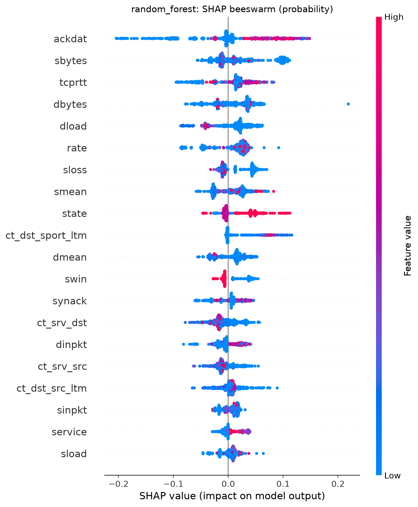
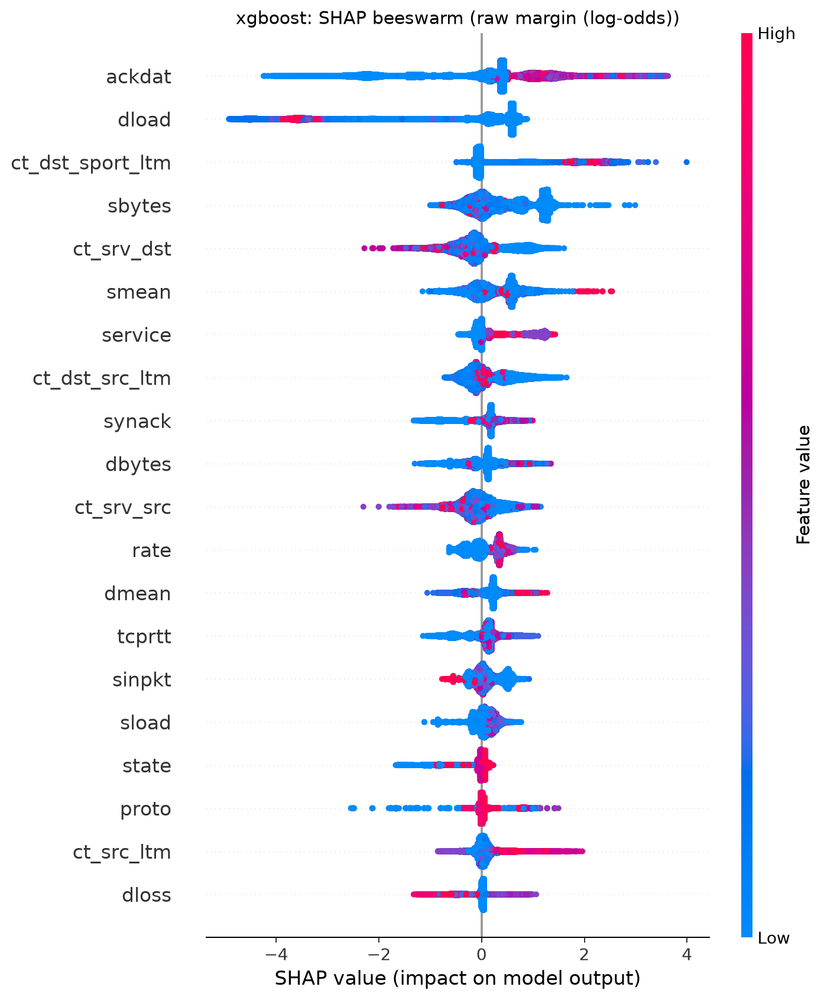
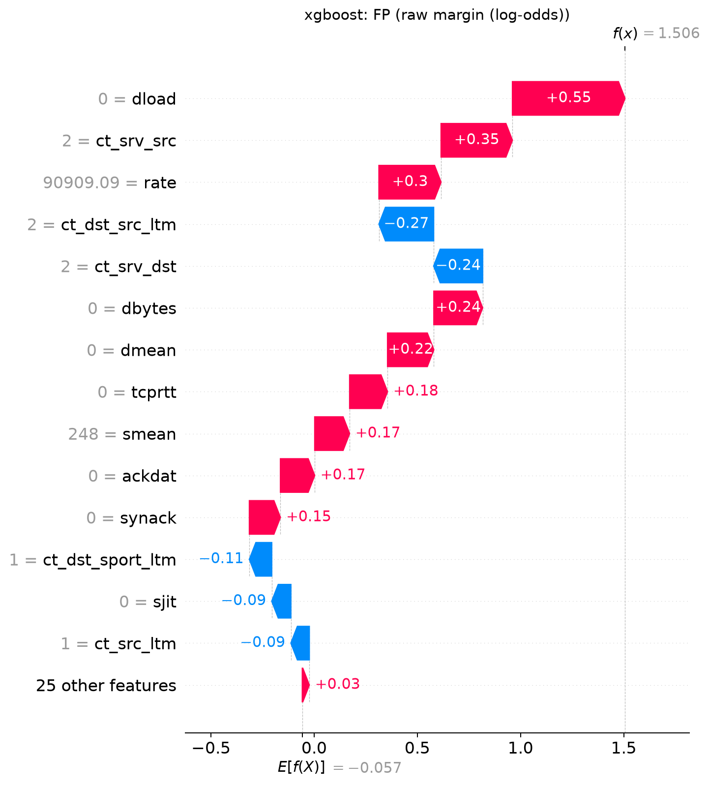
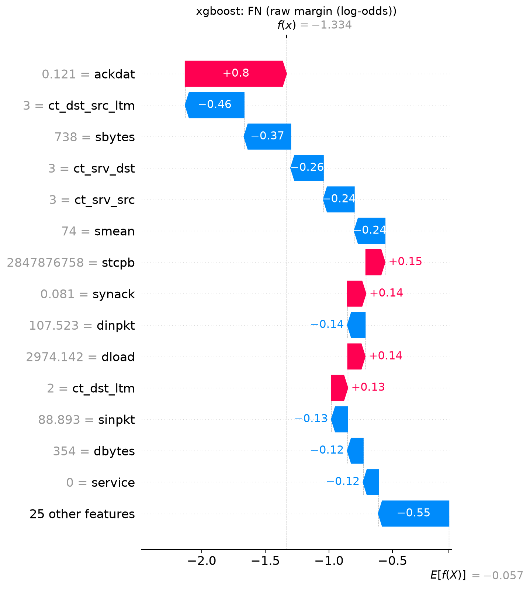
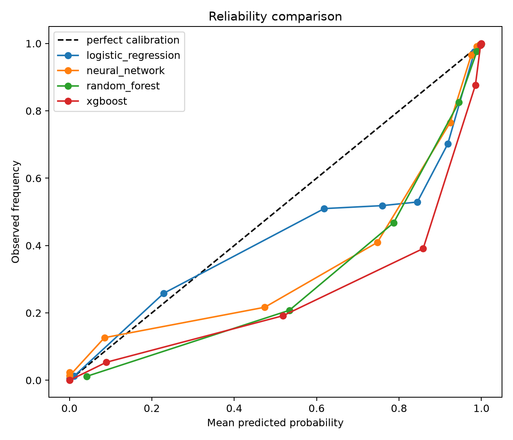
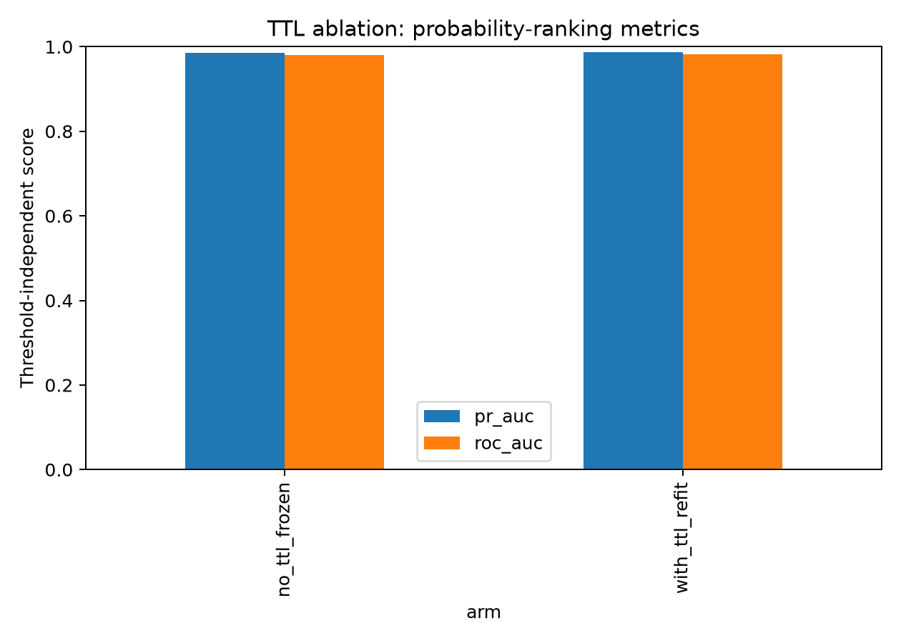

# Explainability and Advanced Diagnostics

## Purpose and diagnostic questions

This section examines the behaviour and reliability of the finalized binary
intrusion-detection models: Logistic Regression, Neural Network, Random Forest,
and XGBoost. It addresses four diagnostic questions: why the models make their
predictions; whether their probabilities can be trusted; whether they depend on
unstable or dataset-specific features; and why they fail on particular samples.
It is an interpretation of frozen outputs, rather than another model-selection
exercise. The standardized evaluation section remains the source for the
cross-model selection decision.

The analyses describe associations in the fitted models and in the fixed data
split; the limitations section sets out what they cannot establish.

## Method and reproducibility

The diagnostics consume frozen model artifacts, finalized predictions, and the
shared train, validation, and test splits. Input provenance is recorded with
SHA digests, and each diagnostics stage has a verification mode that recomputes
its outputs and compares them against the committed files. The workflow uses
the project-wide fixed random state where sampling is required.
All available diagnostics figures are retained under
`experiments/diagnostics/`; only the figures needed to support the discussion
below are embedded here.

All decision thresholds were selected on validation data by the
standardized-evaluation stage. The frozen test set was used only for final
reporting and was never used for tuning or threshold selection. For SHAP,
Random Forest uses a random sample of the frozen test set, whereas XGBoost
covers the full frozen test set, so the two SHAP views differ in coverage as
well as in scale.

Each table in this section is generated directly from an auditable diagnostics
output rather than transcribed by hand, and no diagnostic result was used to
revise a model after the test set was examined.

## Explainability with SHAP

SHAP identifies which transformed input features contributed most strongly to
individual model outputs and, when aggregated, which features most often had
large contributions. Both tree models place `ackdat` at the top of their SHAP
rankings. The next features differ: Random Forest ranks `sbytes` and `tcprtt`
near the top, while XGBoost ranks `dload` and `ct_dst_sport_ltm` immediately
after `ackdat`. This agreement on a leading feature, combined with differences
below it, is consistent with models that use overlapping but not identical
decision structure.

The SHAP scales must not be conflated. Random Forest values are on the
probability scale, while XGBoost values are on the raw margin, or log-odds,
scale because the finalized XGBoost artifact uses SHAP's tree-path-dependent
explainer. Rankings can therefore be compared across the two models, but SHAP
magnitudes cannot. In particular, the `ackdat` entries in T1 do not support a
cross-model magnitude ratio or a claim that one model relies on that feature by
some multiple of the other.

| Model | Rank | Feature | Mean absolute SHAP value | Scale |
|---|---:|---|---:|---|
| Random Forest | 1 | ackdat | 0.0552 | probability |
| Random Forest | 2 | sbytes | 0.0380 | probability |
| Random Forest | 3 | tcprtt | 0.0316 | probability |
| Random Forest | 4 | dbytes | 0.0298 | probability |
| Random Forest | 5 | dload | 0.0294 | probability |
| XGBoost | 1 | ackdat | 1.0111 | raw |
| XGBoost | 2 | dload | 0.9709 | raw |
| XGBoost | 3 | ct_dst_sport_ltm | 0.6708 | raw |
| XGBoost | 4 | sbytes | 0.5233 | raw |
| XGBoost | 5 | ct_srv_dst | 0.3749 | raw |

*Table 1. Leading global SHAP importance, top five per model. Rankings are
comparable across models; magnitudes are not. The full top-ten ranking for both
models is in `experiments/diagnostics/report_tables/t1_shap_global.csv`.*

*Figure 1. Random Forest SHAP beeswarm.*

*Figure 2. XGBoost SHAP beeswarm.*

The beeswarm plots show the distribution of local contributions behind the
global ranking. They are useful for seeing that a global feature can contribute
in different directions on different cases, but they remain descriptions of
model behaviour. Neither a high SHAP value nor a feature's direction of
contribution is evidence that the feature causes an attack.

## Permutation importance

Permutation importance complements SHAP by measuring the reduction in the
chosen evaluation score when a feature is disrupted. The strongest features are
not identical to the SHAP rankings. Logistic Regression is led by
`ct_dst_sport_ltm`, Neural Network by `swin`, and both tree models by `ackdat`.
Such differences are expected: SHAP allocates contribution within a fitted
prediction, whereas permutation importance measures the model's dependence on
a feature under disruption and can be affected by correlated predictors.

| Model | Rank | Feature | Importance mean | Importance standard deviation |
|---|---:|---|---:|---:|
| Logistic Regression | 1 | ct_dst_sport_ltm | 0.1256 | 0.0010 |
| Logistic Regression | 2 | state_con | 0.0934 | 0.0005 |
| Neural Network | 1 | swin | 0.2063 | 0.0005 |
| Neural Network | 2 | sload | 0.1437 | 0.0007 |
| Random Forest | 1 | ackdat | 0.0378 | 0.0002 |
| Random Forest | 2 | sbytes | 0.0271 | 0.0003 |
| XGBoost | 1 | ackdat | 0.0219 | 0.0001 |
| XGBoost | 2 | dload | 0.0139 | 0.0002 |

*Table 2. Leading permutation features by model. The complete ranking is in
`experiments/diagnostics/report_tables/t2_permutation_importance.csv`.*

Together, the two methods support statements about feature reliance, not
causation. Their overlap makes the dependence on `ackdat` in the tree models
particularly visible, while their differences caution against treating either
method as a complete causal explanation.

## Error analysis

At the locked operating thresholds, all models produce both false alerts and
missed attacks. Logistic Regression has the highest false-positive and
false-negative rates in this diagnostic table. Random Forest has the smallest
false-negative rate. Random Forest and XGBoost have effectively the same
false-positive rate, 0.2771 and 0.2769, the lowest among the four models. These
results characterize the selected operating points; they should not be used to
replace the standardized evaluation's broader comparison.

| Model | TP | TN | FP | FN | False-positive rate | False-negative rate |
|---|---:|---:|---:|---:|---:|---:|
| Logistic Regression | 43213 | 22293 | 14707 | 2119 | 0.3975 | 0.0467 |
| Neural Network | 43936 | 23567 | 13433 | 1396 | 0.3631 | 0.0308 |
| Random Forest | 44646 | 26747 | 10253 | 686 | 0.2771 | 0.0151 |
| XGBoost | 44449 | 26753 | 10247 | 883 | 0.2769 | 0.0195 |

*Table 3. Error summary at the locked validation-selected thresholds.*

The local XGBoost explanations below illustrate individual false-positive and
false-negative cases rather than defining a general attack type. A local SHAP
waterfall attributes one prediction to the features seen by that model for that
case. It does not establish why the traffic was truly normal or truly malicious,
and it should be interpreted alongside the aggregate error counts rather than
as a causal account of failure.

*Figure 3. Local XGBoost SHAP explanation for a representative false-positive
case.*

*Figure 4. Local XGBoost SHAP explanation for a representative false-negative
case.*

## Probability calibration

Calibration asks whether a reported attack probability matches the observed
attack frequency at similar scores. Random Forest has the lowest aggregate
Brier score in Table 4, but that does not make it best calibrated in every
part of the score range. XGBoost has the largest single worst-bin gap, even
though its aggregate Brier score is close to Random Forest's. The Brier score
is an aggregate measure and can therefore hide severe local miscalibration.

| Model | Brier score | Expected calibration error | Worst bin | Worst-bin mean predicted | Worst-bin gap | Worst-bin count |
|---|---:|---:|---:|---:|---:|---:|
| Random Forest | 0.0843 | 0.0872 | 2 | 0.5337 | -0.3260 | 8233 |
| XGBoost | 0.0888 | 0.0942 | 5 | 0.8586 | -0.4675 | 8233 |
| Neural Network | 0.0976 | 0.0845 | 5 | 0.7474 | -0.3381 | 8233 |
| Logistic Regression | 0.1406 | 0.0929 | 6 | 0.8444 | -0.3151 | 8234 |

*Table 4. Calibration summary. The gap is observed attack frequency minus
predicted probability. Bin indices are quantile bins computed within each model
and are therefore not directly comparable across models; the mean predicted
column locates each worst bin on the probability scale.*

Every worst-bin gap is negative. Because the gap is observed minus predicted,
the models are overconfident in their reported attack probabilities in those
bins. The reliability overlay places this problem in the mid-to-upper
probability band, while the extremes are close to the ideal relationship. The
plot therefore adds local structure that the aggregate Brier and expected
calibration-error summaries do not capture.

*Figure 5. Reliability overlay for the finalized models.*

These calibration results support cautious use of scores as probabilities. They
do not justify a claim that any model has uniformly trustworthy probability
estimates, nor do they determine which classifier is best overall.

## Distribution drift

The train-to-test drift table flags broad distributional change. Of the 39
features, 29 have PSI above 0.2. `ct_dst_sport_ltm` has the largest listed PSI,
while `dbytes` has the largest listed KS statistic. These observations indicate
elevated generalization risk, not degraded performance by themselves; the
measured frozen-test metrics remain strong.

| Section | Rank | Feature | PSI | KS statistic | Binning strategy |
|---|---:|---|---:|---:|---|
| Top PSI | 1 | ct_dst_sport_ltm | 0.8332 | 0.2811 | value |
| Top PSI | 2 | dmean | 0.5394 | 0.3188 | quantile |
| Top PSI | 3 | dpkts | 0.5233 | 0.3070 | quantile |
| Top KS | 1 | dbytes | 0.5031 | 0.3200 | quantile |
| Top KS | 2 | dmean | 0.5394 | 0.3188 | quantile |
| Top KS | 3 | dload | 0.4497 | 0.3151 | quantile |

*Table 5. Leading drift observations. The complete table is in
`experiments/diagnostics/report_tables/t5_drift_summary.csv`.*

Low-cardinality features use value-based binning. This discrete-aware approach
reports collapsed binning as degenerate or flags it as low resolution instead
of treating it as a spurious PSI of zero. In this run there are no degenerate
features and six low-resolution features, so the main drift summary does not
mistake a collapsed discrete representation for no change.

## Importance and drift overlap

The overlap table brings model reliance and distribution shift together. The
same high-drift features recur among leading permutation features: for example,
`ct_dst_sport_ltm`, `dbytes`, and `dload` appear in the overlap. There are
three overlap entries for Logistic Regression, seven for Neural Network, four
for Random Forest, and four for XGBoost. This alignment raises generalization
risk because important parts of the models' input structure are also shifted.

| Model | Feature | Permutation rank | Drift PSI rank | Drift KS rank | PSI | KS statistic |
|---|---|---:|---:|---:|---:|---:|
| Logistic Regression | ct_dst_sport_ltm | 1 | 1 | 11 | 0.8332 | 0.2811 |
| Neural Network | dmean | 4 | 2 | 2 | 0.5394 | 0.3188 |
| Random Forest | dbytes | 5 | 5 | 1 | 0.5031 | 0.3200 |
| XGBoost | dload | 2 | 6 | 3 | 0.4497 | 0.3151 |

*Table 6. Selected importance-by-drift overlaps. The full table is in
`experiments/diagnostics/report_tables/t6_drift_importance_overlap.csv`.*

The overlap does not show that drift caused the errors or that the models will
fail outside this split. It identifies an evidence-backed area of uncertainty:
the features used for prediction are not all stable between the observed train
and test distributions.

## TTL ablation

The primary preprocessing pipeline excludes TTL features. The TTL-included arm
is a diagnostic comparison only and was never a production candidate. Its
purpose is to test whether a known dataset-specific signal changes the fitted
model's internal reliance disproportionately to its test-set benefit.

All decision thresholds were selected on validation data by the
standardized-evaluation stage. For this ablation, the same validation-selected
threshold was applied unchanged to both arms, which makes the secondary
operating-point metrics like-for-like. The locked threshold and accompanying
note are retained with T7 in the report tables.

| Metric | No-TTL frozen | With-TTL refit | Delta |
|---|---:|---:|---:|
| PR-AUC | 0.9859 | 0.9870 | +0.0011 |
| ROC-AUC | 0.9809 | 0.9824 | +0.0015 |
| F1 at locked threshold | 0.8887 | 0.8910 | +0.0022 |
| Precision at locked threshold | 0.8127 | 0.8146 | +0.0020 |
| Recall at locked threshold | 0.9805 | 0.9831 | +0.0026 |
| Accuracy at locked threshold | 0.8648 | 0.8675 | +0.0027 |

*Table 7. TTL ablation comparison using the same validation-selected threshold
for both arms.*

The aggregate gains are small, yet the importance structure changes sharply.
With TTL included, `sttl` becomes rank 1 with importance 0.0817. That exceeds
the no-TTL model's leading `ackdat` importance of 0.0219, while `ackdat` moves
from rank 1 to rank 33 with importance 0.0000. The combination of major
internal restructuring and a negligible PR-AUC gain of +0.0011 is the central
shortcut-learning finding: TTL carries a dataset-specific signal that can
dominate feature reliance without materially improving the reported aggregate
ranking result.

| Feature | No-TTL rank | No-TTL importance | With-TTL rank | With-TTL importance |
|---|---:|---:|---:|---:|
| ackdat | 1 | 0.0219 | 33 | 0.0000 |
| dload | 2 | 0.0139 | 13 | 0.0010 |
| ct_dst_sport_ltm | 3 | 0.0062 | 2 | 0.0076 |
| sttl | — | — | 1 | 0.0817 |
| ct_state_ttl | — | — | 11 | 0.0019 |
| dttl | — | — | 28 | 0.0002 |

*Table 8. Selected rank shifts and TTL shortcut-feature evidence. The full
rank-shift table is in `experiments/diagnostics/report_tables/t8_ttl_rank_shift.csv`.*

*Figure 6. TTL ablation: changed feature rankings alongside the comparison
metrics.*

The ablation should not be read as evidence that TTL information is broadly
useful outside this dataset. Its value is diagnostic: it exposes how a feature
family can attract substantial model reliance even when the measured gain is
limited. The primary, TTL-excluded pipeline remains the relevant pipeline for
the finalized comparison.

## Limitations and non-causality

These diagnostics are descriptive analyses of one dataset and one frozen split.
SHAP and permutation importance show how the fitted models use available
features; neither method proves that a feature causes attacks. Drift measures
distributional difference, not a performance outcome or a deployment forecast.
The representative local explanations also illuminate model reasoning for
selected samples, not the full causal history of each network flow.

The evidence is therefore sufficient to identify uncertainty and potential
shortcut reliance, but not to infer attack families, causal mechanisms, or a
universal winner among the models; the standardized evaluation section remains
the source for that comparison.

## Key conclusions

### Why is the model making these predictions?

The tree models both rank `ackdat` first in global SHAP, and the same feature is
first in their permutation rankings. Other leading features differ by model in
permutation importance, including `ct_dst_sport_ltm` for Logistic Regression and
`swin` for Neural Network. This is evidence of model reliance and association,
not evidence that these variables cause attack traffic.

### Can its probabilities be trusted?

Random Forest has the lowest listed Brier score, 0.0843, but every model has a
negative worst-bin gap. XGBoost's worst-bin gap is -0.4675, showing that a good
aggregate score can coexist with severe local overconfidence. The reliability
overlay indicates that the issue is concentrated away from the extremes, so
probabilities should be interpreted with that calibration limitation in mind.

### Is it relying on unstable or dataset-specific features?

The drift table shows 29 of 39 features above PSI 0.2, and high-drift features
also occur among the leading permutation features. The TTL ablation provides a
more direct shortcut signal: adding TTL makes `sttl` rank 1 while pushing
`ackdat` to rank 33 for only a +0.0011 PR-AUC change. This supports elevated
generalization risk and dataset-specific feature reliance, not a claim that
deployment degradation is certain.

### Why does it fail on certain samples?

The locked-threshold error patterns include false-positive rates from 0.2769 to
0.3975 and false-negative rates from 0.0151 to 0.0467. The representative
waterfalls explain how XGBoost's feature contributions combine on selected
false-positive and false-negative cases, while Table 3 supplies the aggregate
context. They do not identify a causal reason for any individual mistake.
